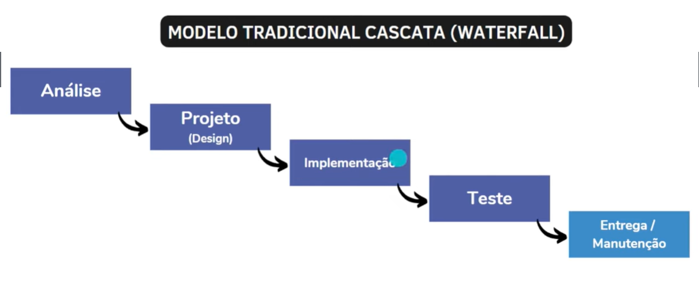

# Trabalhando em Equipes Ágeis

Pra que?: Aprender sobre Agile
Conteúdos DB: Metodologia Ágil (Agile) (<https://www.notion.so/Metodologia-gil-Agile-0046656d6fbb4fa8afc559634129c2ed?pvs=21>)
Categoria: Curso
Status: Done
Plano de estudos DB: Backend com Kotlin  (<https://www.notion.so/Backend-com-Kotlin-bb7bbc8a2a3443ed9470a119aa6e2d30?pvs=21>)
Data: 22/11/2023

## Índice

- [Trabalhando em Equipes Ágeis](#trabalhando-em-equipes-ágeis)
  - [Índice](#índice)
  - [Antes de começar](#antes-de-começar)
  - [Introdução à cultura ágil](#introdução-à-cultura-ágil)
    - [Apresentação do curso](#apresentação-do-curso)
    - [Agilidade x rapidez](#agilidade-x-rapidez)
    - [Os 3 valores do manifesto ágil](#os-3-valores-do-manifesto-ágil)
    - [Os 12 princípios do manifesto ágil](#os-12-princípios-do-manifesto-ágil)
    - [As características de um time ágil](#as-características-de-um-time-ágil)
  - [Gerenciamento de projetos e gestão ágil](#gerenciamento-de-projetos-e-gestão-ágil)
    - [Projetos x processo](#projetos-x-processo)
    - [Modelo Ágil x tradicional](#modelo-ágil-x-tradicional)
    - [O que é gestão Ágil?](#o-que-é-gestão-ágil)
  - [Métodos e Ferramentas Ágeis](#métodos-e-ferramentas-ágeis)
    - [O que é Scrum](#o-que-é-scrum)
    - [O Framework Scrum](#o-framework-scrum)
    - [O que é XP?](#o-que-é-xp)
    - [Kanban](#kanban)
    - [O que é OKR](#o-que-é-okr)
    - [Exemplos de OKRs](#exemplos-de-okrs)
    - [Ferramentas para a Gestão Ágil](#ferramentas-para-a-gestão-ágil)

## Antes de começar

- [x]  Criar pasta referente ao curso
- [x]  Adicionar link da pasta nos atributos do curso
- [x]  Adicionar arquivos e links adicionais ao repositório (pdf, pptx, etc)

## Introdução à cultura ágil

### Apresentação do curso

Esse curso visa:

- Apresentar os conceitos do que é Ágil
- Apresentar os principais métodos e ferramentas ágeis

Primeiramente falaremos sobre a cultura ágil

Depois vão ser apresentandos conceitos de gerenciamento de projetos

Depois serão apresentados métodos e ferramentas de gestão ágil

### Agilidade x rapidez

Quem é mais rápido, um guepardo ou trem bala?

O trem bala chega a +200km por hora e o guepardo a 130km

Mas e quem é mais ágil? O guepardo, sem dúvidas.

> Ser ágil não significa ser mais rápido!
>

A vantagem do guepardo é conseguir se adaptar melhor às situações, de forma que consiga ajustar o percurso para corrigir uma rota.

Ter um time veloz traz alguns problemas, como:

- estresse por estar focado em entregar
- Dificuldade em ver o valor das entregas por estar se preocupando apenas em entregar

Já ser ágil permite:

- Trabalhar com foco
- Trabalhar com reflexão pautada nos objetivos
- Trabalhar visando melhoria contínua

### Os 3 valores do manifesto ágil

O manifesto ágil é um documento escrito em 2021 por 17 profissionais que já praticavam métodos ágeis.

Esse documento lista 4 valores e 12 princípios de métodos ágeis, sendo eles:

- Os 4 valores
    1. Indivíduos e interações são mais que processos e ferramentas →  Não basta trocar ferramentas e trocando processos, o foco são os indivíduos e trocas
    2. Software em funcionamento, mais que documentação abrangente → É mais valioso entregar o produto funcionando do que relatórios e documentações a respeito do produto
    3. Responder a mudanças, mais que seguir um plano → estar flexível para responder as mudanças e se adaptar é mais importante do que focar no plano
    4. Colaboração com o cliente, mais que negociação de contratos → é melhor colaborar com o cliente para entregar o que ele precisa do que se preocupar com o contrato e a entrega estipulada por ele.

### Os 12 princípios do manifesto ágil

O manifesto ágil possui 12 princípios fundamentais, mas neste caso vamos focar em alguns que agregam mais com o propósito do curso.

Posteriormente pode-se pesquisar os demais princípios

Os princípios incluem:

1. A nossa maior prioridade é **satisfazer o cliente** através da entrega contínua e adiantada de software com valor agregado.

1. Aceitar mudanças de requisitos mesmo no fim do desenvolvimento. Processos ágeis se **adequam às mudanças** para fazer com que o cliente tire vantagens competitivas.

1. O método mais eficiente de transmitir informações entre a equipe é **face a face**

1. Simplicidade: a arte de maximizar a quantidade de trabalho realizado é essencial → focar no essencial, diminuir desperdício de tempo

1. Em intervalos regulares a equipe reflete sobre como se tornar mais eficaz e então refina e ajusta seu comportamento de acordo. → necessário refletir buscando refinar o processo

### As características de um time ágil

Uma equipe ágil consiste em algumas características, como:

- Estar alinhada ao cliente e stakeholders
- Auto-organizado e responsável → time capaz de se organizar e responsabilizar pelas tarefas, não precisando de um micro gerenciamento
- Multidisciplinar → um time composto por pessoas diferentes, com domínios e experiências diferentes
- Entrega valor continuamente →sempre entrega alguma coisa
- Está sempre aprendendo → time que sempre aprende com as experiências, positivas ou negativas
- Melhoria contínua → usa o aprendizado para melhorar
- Possui métricas e metas claras → o time precisa de métricas e metas claras e transparentes para saber o norte que estão indo
- Unido → time alinhado aos objetivos em comum

## Gerenciamento de projetos e gestão ágil

### Projetos x processo

Para entender o gerenciamento de projetos na metodologia ágil, antes temos que entender as diferenças entre projetos e processos.

Um processo é:

- Recorrente e contínuo →
- Replicável →
- Geralmente é repetitivo e realizado regularmente

Já um projeto é:

- Um esforço temporário para atingir um objetivo
- O resultado é exclusivo
- Tem início e fim bem definidos

 Para ilustrar, podemos entender o funcionamento de um processo de solicitação de compra de um notebook em uma empresa.

Primeiramente a pessoa entra em contato com o responsável pelo setor de compras que irá fazer um orçamento e depois apresentar para o gestor que irá ou não aprovar a compra. Após isso, o setor realiza a compra.

Já um projeto de elaboração de um novo fone de ouvido de uma empresa terá os passos abaixo.

Primeiramente vão definir um objetivo que neste caso é a criação de um novo modelo de fone de ouvido. Depois passará pelas etapas do projeto (desenvolvimento de layout, comparação com concorrentes, etc). Depois será feita a entrega do produto, o novo fone.

> Lembrando que projetos são esforços temporários com objetivo de entrega de um resultado exclusivo, não repetitivos
>

### Modelo Ágil x tradicional

Antes de entender a diferença entre os dois modelos, devemos entender as etapas do modelo tradicional.

No **modelo tradicional** se usa o modelo waterfall (cascata) onde as próximas etapas dependem da etapa anterior

- Exemplo

    

O problema dessa abordagem é que a entrega de valor para o cliente começa somente na etapa final de entrega.

- Exemplo

    

Já no modelo **ágil com scrum** a entrega de valor é periódica, dividida em sprints de execução do projeto.

Dessa forma, o cliente recebe a entrega de forma incremental e cíclica.

- Exemplo

    

> No SCRUM o desenvolvimento é interativo e incremental
>

A maior vantagem é o feedback constante, tanto por parte da equipe quanto por parte do projeto, já que a entrega é feita em ciclos divididos.

- Exemplo

    

Qual o melhor?

- Depende

O modelo waterfall não está no mercado há tanto tempo por nada. Alguns projetos podem aproveitar melhor o padrão waterfall, por exemplo, projetos de engenharia onde cada etapa depende de uma etapa anterior.

### O que é gestão Ágil?

Gestão ágil é uma forma de gestão que seja:

- Flexível, ou seja, se adapte às mudanças
- Colaborativa e que gere transparência
- Voltada ao aprendizado
- Voltada à Entrega Contínua de Valor

## Métodos e Ferramentas Ágeis

### O que é Scrum

Durante as próximas aulas vamos aprender sobre alguns dos métodos ágeis:

- Framework Scrum
- Extreme Programming (XP)
- Kanban
- OKR

- **Definição de Scrum**

    

    Essa definição foi retirada do Guia do Scrum criado pelos criadores do Scrum.

- **As bases do Scrum**

    O Scrum toma como base o **EMPIRISMO**, ou seja, com base no observado, no que é factível.

    O Scrum também tem como base o **LEAN THINKING** que foca em não desperdiçar recursos, sendo tempo, energia ou foco nos projetos.

    

- **Os pilares do Scrum**

    Um dos pilares do Scrum é a **TRANSPARÊNCIA**, ou seja, todos os ângulos de qualquer processo Scrum podem ser observados por qualquer pessoa.

    Isso promove uma cultura aberta e transparente, de fácil colaboração na equipe

    Outro pilar é a **INSPEÇÃO**, ou seja, a arte de pensar com senso crítico sobre tudo o que está acontecendo. É detectar variações ou problemas potencialmente indesejáveis.

    - Olhar e medir o progresso do time
    - Ter feedback dos clientes e stakeholders

    **ADAPTAÇÃO** é o terceiro pilar, ou seja, se adaptar às mudanças. Isso só é possível graças à transparência e a inspeção, que proporcionam visão macro com senso crítico, permitindo melhoras contínuas.

### O Framework Scrum

Afinal, o Scrum é um framework ou metodologia Agil?

O Scrum é propositalmente **incompleto.** Nele só existem as partes necessárias para implementar as teorias do Scrum.

Em vez de fornecer às pessoas **instruções detalhadas** as regras do Guia do Scrum orientam seus relacionamentos e interações.

Uma metodologia propõe tudo o que deve ser feito, **como** deve ser feito e quando deve ser feito.

No caso de frameworks, eles apenas propõem as orientações de forma aberta, dizendo o que deve ser feito, mas não os métodos para isso.

Abaixo o diagrama do Scrum Framework:

Seguindo o diagrama do framework começamos com o **backlog do produto** que é uma lista ordenada com todos os recursos que o produto deve ter.

Depois vamos pra etapa de planejamento de sprint, que vai pegar a lista e planejar o que pode ser feito na sprint. Como resultado teremos o backlog da sprint, que nada mais é do que o conjunto de tarefas que precisam ser atacadas nessa etapa.

Depois distribuímos a responsabilidade da sprint entre a equipe, geralmente composta por um especialista de scrum, o proprietário do produto e desenvolvedores. Durante essa etapa é fundamental que haja a reunião diária de alinhamento, para acompanhar o progresso da sprint.

Ao final da etapa vai haver o incremento das funcionalidades e depois a revisão da sprint para ver se ela está alinhada com o resto do projeto.

Ao fim de tudo essas informações retornam para serem avaliadas e criadas novas sprints do projeto.

### O que é XP?

XP significa Xtreme Programming, que é um método ágil criado no final da década de 90.

Essa metodologia tem como foco a interação próxima com os clientes, testagem constante e ciclos curtos de desenvolvimento.

O que tem no XP?

- Ciclos
- “Cerimônias” (equivalente aos eventos do SCRUM)
- Testes
- Programação em pares
- Feedback
- Aproximação com cliente
- Flexibilidade

### Kanban

Kanban é um método para definir, gerenciar e melhorar a entrega de serviços e trabalhos.

> A simplicidade do Kanban o torna um dos métodos mais utilizados nas empresas em todos os segmentos
>

O Kanban foi desenvolvido pela Toyota em 1940 para aumentar o controle do estoque, evitando o desperdício.

Já hoje em dia ele é um método muito usado em equipes de marketing, prestação de serviços e até em desenvolvimento de softwares.

Kanban funciona como uma ferramenta de gestão de tarefas

O Kanban funciona como um quadro:

Esse quadro aumenta a visibilidade das tarefas, permitindo visualizar todo o projeto.

Uma curiosidade:

### O que é OKR

OKR são Objetivos Key Results, que é um método ágil desenvolvido pelo ex-CEO da Intel, Andrew Groove.

Antes de mais nada precisamos entender a estrutura de OKRs onde **objetivos** são descrições **qualitativas**  que apontam a direção que deverá ser seguida pela empresa.

O objetivo precisa ser:

- Claro
- Inspirador
- Desafiador
- Alinhado com a missão do negócio

Alguns exemplos incluem:

- Criar uma experiência inesquecível para o cliente em todos os pontos de contato;
- Crescer em vendas na região sul do país
- Tornar-se referência nacional e autoridade absoluta na área de Educação em Tecnologia

Depois de termos os objetivos definidos, devemos criar as **Key Results** que são as metas necessárias para alcançar o objetivo.

Levando isso em conta, essas metas precisam ser:

- Baseadas em indicadores-chave de desempenho (KPIs)
- Quantitativas
- SMART: Específicas, Mensuráveis, Atingíveis, Relevantes e Temporais

> Assim os KRs servirão de referência para acompanhar o progresso até o objetivo principal
>

### Exemplos de OKRs

Por exemplo, considerando o objetivo:

> Criar uma experiência inesquecível para o cliente em todos os pontos de contato
>

Os KRs podem ser:

1. Integrar a base de dados dos 5 canais de atendimento
2. Contratar mais 15 atendentes e 1 gestor de comunidade
3. Alcançar um NPS de 80%

Uma boa dica é que para cada Objetivo em média se usa de 2 a 5 Resultados Chaves, apesar disso não ser uma regra.

E dependendo da empresa, essas metas podem ser criadas para o mês, trimestre ou ano. Depende muito da necessidade do negócio.

### Ferramentas para a Gestão Ágil

