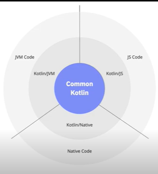

# Conhecendo o Kotlin e sua Documentação Oficial

Pra que?: Curso para introduzir a linguagem Kotlin
Links: GitHub: <https://github.com/marlonprado04/BOOTCAMP_backend_com_kotlin/tree/main/05_CURSO_conhecendo_kotlin>
Conteúdos DB: Kotlin (<https://www.notion.so/Kotlin-c848ec969da34f13b537af3274acc0ff?pvs=21>)
Categoria: Curso
Plano de estudos DB: Backend com Kotlin  (<https://www.notion.so/Backend-com-Kotlin-bb7bbc8a2a3443ed9470a119aa6e2d30?pvs=21>)
Criado em: December 13, 2023 7:16 PM
Modificado em: December 19, 2023 3:15 PM

## Índice

- [Conhecendo o Kotlin e sua Documentação Oficial](#conhecendo-o-kotlin-e-sua-documentação-oficial)
  - [Índice](#índice)
  - [Antes de começar](#antes-de-começar)
  - [Apresentação](#apresentação)
    - [Apresentação e objetivos](#apresentação-e-objetivos)
    - [Introdução ao Kotlin](#introdução-ao-kotlin)
    - [Documentação **Oficial e Instalação do Kotlin**](#documentação-oficial-e-instalação-do-kotlin)
    - [Porque o Kotlin](#porque-o-kotlin)
    - [Links e referências](#links-e-referências)

## Antes de começar

- [x]  Criar pasta referente ao curso
- [x]  Adicionar link da pasta nos atributos do curso
- [x]  Adicionar arquivos e links adicionais ao repositório (pdf, pptx, etc)

## Apresentação

### Apresentação e objetivos

Neste curso vamos aprender as possibilidades e particularidades da linguagem.

### Introdução ao Kotlin

Durante essa série de aulas vamos aprender sobre as áreas que o Kotlin atua.

Nas próximas vamos aprender a configurar o ambiente em Kotlin e também vamos entender o porquê usar Kotlin.

Para começarmos entendendo o que é o Kotlin podemos antes entender como a própria dona do Kotlin posiciona ele.

Parafreasenado:

> Kotlin é uma linguagem concisa, segura, interoperável com Java e outras linguagens além
>

A documentação oficial do Kotlin se encontra [neste link](https://kotlinlang.org/docs/home.html)

Abaixo um diagrama interessante que demonstra bem a interoperabilidade de Kotlin com outras linguagens:

### Documentação **Oficial e Instalação do Kotlin**

O Kotlin já está incluso no IntelliJ IDEA e Android Studio

Entretanto, podemos utilizar o Kotlin sem nenhum desses IDEs, através do [Kotlin Playground](https://play.kotlinlang.org/#eyJ2ZXJzaW9uIjoiMS45LjIxIiwicGxhdGZvcm0iOiJqYXZhIiwiYXJncyI6IiIsIm5vbmVNYXJrZXJzIjp0cnVlLCJ0aGVtZSI6ImlkZWEiLCJjb2RlIjoiLyoqXG4gKiBZb3UgY2FuIGVkaXQsIHJ1biwgYW5kIHNoYXJlIHRoaXMgY29kZS5cbiAqIHBsYXkua290bGlubGFuZy5vcmdcbiAqL1xuZnVuIG1haW4oKSB7XG4gICAgcHJpbnRsbihcIkhlbGxvLCB3b3JsZCEhIVwiKVxufSJ9)

A documentação do Kotlin está muito bem organizada. Através dela podemos:

- Ver os usos possíveis do Kotlin;
- Acessar ao playground para realizar o teste da linguagem online

Dentro do playground podemos visitar projetos práticos e o Koans que são desafios de código que mantém o progresso:

Além disso também podemos acessar ao GitHub da linguagem que é Open Source. O repositório se encontra [nesse link](https://github.com/JetBrains/kotlin-web-site/tree/master) mas pode ser acessado através da própria documentação.

### Porque o Kotlin

Na própria documentação da linguagem temos algumas justificativas para o uso da linguagem, por exemplo:

- Concisa → pouco verbosa, fácil de desenvolver com pouco código;
- Segura → existem tratamentos que diminuem a chance de erro em trabalhar com nulos ou na hora de estender classes que por padrão não são extensíveis;
- Expressiva → é fácil de compreender um código
- Interoperável
- Multiplataforma

### Links e referências

Apostila de apresentação do curso:

[Curso 1 - Conhecendo o Kotlin e Sua Documentação Oficial.pdf](./.for_readme/Curso_1_-_Conhecendo_o_Kotlin_e_Sua_Documentao_Oficial.pdf)
