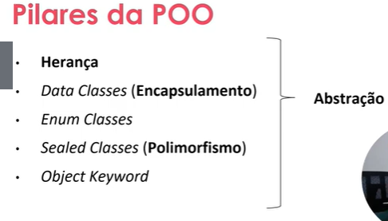

# Orientação a Objetos e Tipos de Classes na Prática com Kotlin

Para quê?: Aprender OO em Kotlin
GitHub: <https://github.com/marlonprado04/BOOTCAMP_backend_com_kotlin/tree/main/08_CURSO_poo_na_pratica_em_kotlin>
Conteúdos DB: Kotlin (<https://www.notion.so/Kotlin-c848ec969da34f13b537af3274acc0ff?pvs=21>)
Categoria: Curso
Status: In Progress
Plano de estudos DB: Backend com Kotlin  (<https://www.notion.so/Backend-com-Kotlin-bb7bbc8a2a3443ed9470a119aa6e2d30?pvs=21>)
Criado em: December 28, 2023 4:49 PM
Modificado em: January 5, 2024 3:17 PM

## Índice

- [Orientação a Objetos e Tipos de Classes na Prática com Kotlin](#orientação-a-objetos-e-tipos-de-classes-na-prática-com-kotlin)
  - [Índice](#índice)
  - [Antes de começar](#antes-de-começar)
  - [Apresentação](#apresentação)
    - [Introdução e objetivos](#introdução-e-objetivos)
  - [Programação Orientada a Objetos (POO)](#programação-orientada-a-objetos-poo)
    - [Abstração](#abstração)
    - [Encapsulamento](#encapsulamento)
    - [Herança](#herança)
    - [Polimorfismo](#polimorfismo)
    - [POO com Kotlin: Exemplos que vamos praticar](#poo-com-kotlin-exemplos-que-vamos-praticar)
  - [POO na prática com Kotlin](#poo-na-prática-com-kotlin)
    - [Herança Simples](#herança-simples)
    - [Herança Com Construtor Parametrizado](#herança-com-construtor-parametrizado)
    - [Herança Passando Argumentos do Construtor para a Superclasse](#herança-passando-argumentos-do-construtor-para-a-superclasse)
    - [Data Classes](#data-classes)
    - [Enum Classes](#enum-classes)
    - [Sealed Classes](#sealed-classes)
    - [Object Keyword](#object-keyword)
  - [Materiais de apoio e referências](#materiais-de-apoio-e-referências)

## Antes de começar

- [x]  Criar pasta referente ao curso
- [x]  Adicionar link da pasta nos atributos do curso
- [x]  Adicionar arquivos e links adicionais ao repositório (pdf, pptx, etc)

## Apresentação

### Introdução e objetivos

Durante este curso vamos aprender sobre POO em Kotlin, aprender sobre as diferenças e tipos de classes em Kotlin.

## Programação Orientada a Objetos (POO)

### Abstração

A habilidade de abstração envolve se concentrar nos aspectos essenciais de um problema, ignorando características menos importantes do problema.

Dessa forma, podemos construir uma solução mais voltada para a necessidade de resolução do problema.

Pegando como exemplo uma aplicação para o controle de ponto de um banco, ao invés de nos preocuparmos com todo o processo envolvendo um banco, devemos abstrair e focar somente no necessário para resolução deste problema. Neste caso, ter uma classe “funcionário” e outras classes filhas “gerente”, “segurança”… Podem ser úteis para resolução deste problema.

### Encapsulamento

O segundo pilar da programação é o Encapsulamento.

O encapsulamento envolve esconder as implementações quando elas não precisam ser expostas à recursos e acessos externos, o que envolve tanto getters e setters quanto outras formas de encapsulamento.

Novamente, o encapsulamento é usado quando convém ocultar certas coisas para resolução de um problema. O encapsulamento traz como vantagem:

- A fácil manutenção do código
- A evolução do código

### Herança

A herança permite o compartilhamento de propriedades e funções de classes.

Ela está diretamente relacionada com o encapsulamento, pois muitas vezes não queremos que todas as funções e propriedades sejam herdadas pelos filhos, de forma que seja possível encapsular recursos desnecessários.

### Polimorfismo

Polimorfismo é a capacidade de um objeto ser referenciado de formas diferentes.

Por exemplo, no caso da aplicação do banco, seria a capacidade de tratar um gerente tanto como gerente quanto como funcionário, de forma que ele tenha propriedades genéricas. Ex, se quisermos uma função que aumenta o salário do funcionário ao fim do ano, podemos passar como parâmetro tanto um gerente quanto um atendente, já que herdam as características de funcionários.

### POO com Kotlin: Exemplos que vamos praticar

Agora vamos verificar como esses pilares de POO se encaixam em Kotlin



## POO na prática com Kotlin

### Herança Simples

Em Kotlin a herança é muito segura e respeitada.

Toda classe por padrão é final, ou seja, não pode ser sobrescrita por outra classe.

Abaixo um exemplo de uso de extensão de classe em Kotlin

```kotlin
// Para que a classe possa ser extendida em outra
// é necessário iniciar a declaração com o modificador "open"
open class Dog {
    // O mesmo vale para funções
    open fun sayHello() {
        println("wow wow!")
    }
}

// Para implementar a classe, usamos a sintaxe abaixo
// le-se: Yorkshire é um cachorro
class Yorkshire : Dog() {
    // Para aproveitar a função compartilhada, usamos o modificador
    // override para sobreescrever a função 
    override fun sayHello() {
        println("wif wif!")
    }
}

fun main() {
    // Instanciando o cachorro e tipando como um cachorro
    // mas atribuindo um tipo Yorkshire para ele
    val dog: Dog = Yorkshire()
    // Printando mensagem 
    dog.sayHello()
}
```

### Herança Com Construtor Parametrizado

Em Kotlin podemos passar um construtor como parâmetro da classe, conforme demonstração no código abaixo:

```kotlin
// Criando classe que pode ser herdada
open class Tiger(val origin: String) {
    // Função para dizer olá
    fun sayHello() {
        println("A tiger from $origin says: grrhhh!")
    }
}

// Criando classe que constroi um tigre da sibéria
class SiberianTiger : Tiger("Siberia")

fun main() {
    val tiger: Tiger = SiberianTiger()
    tiger.sayHello()
}
```

Isso dá autonomia e maior legibilidade de código, permitindo fácil refatoração e interpretação.

### Herança Passando Argumentos do Construtor para a Superclasse

No Kotlin podemos criar classes para passar argumentos para uma superclasse.

Abaixo um exemplo onde passamos informações de uma classe secundária para uma superclasse `Lion`:

```kotlin
// Cria classe que pode ser extendida em outras classes
open class Lion(val name: String, val origin: String) {
    // Cria função para dizer olá
    fun sayHello() {
        println("$name, the lion from $origin says: graoh!")
    }
}

// Cria classe para instanciar um leão asiático que só recebe o nome (a origem é sempre a mesma)
class Asiatic(name: String) : Lion(name = name, origin = "India")

fun main() {
    // Cria instância de Leão e passa como parâmetro
    // a classe asiatica criada
    val lion: Lion = Asiatic("Rufo")
    lion.sayHello()
}
```

### Data Classes

Em Kotlin ao declarar uma `data class` , a linguagem já gera diversos dos métodos para as variáveis passadas no construtor, como toString, equals, hashcode, etc…

Abaixo exemplos de métodos que a data class permite facilitdade:

```kotlin
// Declara data class de usuário
data class User(val name: String, val id: Int) {
    // Função para comparar somente o id via equals 
    override fun equals(other: Any?) =
        other is User && other.id == this.id
}

fun main() {
    // Cria usuário
    val user = User("Alex", 1)
    
    // Printa valores da classe instanciada
    println(user) // User(name=Alex, id=1)
    
    // Cria um usuário igual ao primeiro
    val secondUser = User("Alex", 1) // true
    // Cria um usuário diferente do primeiro
    val thirdUser = User("Max", 2) // false

    // Printa a comparação entre usuários
    println("user == secondUser: ${user == secondUser}")
    println("user == thirdUser: ${user == thirdUser}")

    // Usando função hashCode para gerar o ID único a partir das variáveis de cada classe
    println(user.hashCode()) 
    println(secondUser.hashCode())
    println(thirdUser.hashCode())

    // Usando função copy para gerar uma cópia de instância sem usar a mesma referência na memória
    println(user.copy())
    // Printando resultado da comparação de endereço do usuário com a cópia dele 
    println(user === user.copy())
    // Printando cópia de usuário e modificando nome na hora de copiar
    println(user.copy("Max"))
    // printando cópia e modificando o ID
    println(user.copy(id = 3))

    // Printando os componentes de acordo com a ordem de declarção
    println("name = ${user.component1()}") // Alex
    println("id = ${user.component2()}") // 1
}
```

### Enum Classes

Enum são classes com um número finito, geralmente usadas para demonstrar estados da aplicação, por exemplo, estado de loading ou sucesso ou erro.

Enums são classes utilizadas para valores bem definidos, como constantes.

Abaixo um exemplo de uso do Enum com as possibilidades bem definidas:

```kotlin
// Cria classe enum com estados de IDLE, RUNNING e FINISHED
enum class State {
    IDLE, RUNNING, FINISHED
}

fun main() {
    // Cria variável com estado de RUNNING
    val state = State.RUNNING
    
    // Armazena mensagem de acordo com o valor da variável state
    val message = when (state) {
        State.IDLE -> "It's idle"
        State.RUNNING -> "It's running"
        State.FINISHED -> "It's finished"
    }
    
    // Printa mensagem
    println(message) // It's running
}
```

Outro exemplo de uso dos Enums são funções mais complexas, por exemplo, no caso abaixo criamos uma função para verificar se o valor RGB possui informação vermelho:

```kotlin
// Cria classe enum valores RGB padrão
// e recebe valor no construtor
enum class Color(val rgb: Int) {
    RED(0xFF0000),
    GREEN(0x00FF00),
    BLUE(0x0000FF),
    YELLOW(0xFFFF00);
	
    // Cria função para verificar se a cor passada
    // na construção possui vermelho
    fun containsRed() = (this.rgb and 0xFF0000 != 0)
}

fun main() {
    // Cria variável com a cor RED já definida no enum
    val red = Color.RED
    
    // Printa a variável (vem a informação literal do enum)
    println(red) // RED
    
    // Verificando se as cores criadas possuem vermelho 
    // em suas informação
    println(red.containsRed())
    println(Color.BLUE.containsRed())
    println(Color.YELLOW.containsRed())
}
```

### Sealed Classes

Sealed Classes ou classes Seladas são classes que garantem que ela não será estendida fora do pacote que ela se encontra, ou seja, ela é usada para delimitar e restringir as possíveis extensões.

Ela é comumente usada quando temos um número finito de subclasses que podem estender ela.

Abaixo um exemplo de uso:

```kotlin
// Cria uma classe selada do tipo mamífero
sealed class Mammal(val name: String)

// Cria classes gato e humano que vão extender a classe mamífero
// e passa os nomes específicos para a classe mamífero
class Cat(val catName: String) : Mammal(catName)
class Human(val humanName: String, val job: String) : Mammal(humanName)

// Cria função genérica de mamífero para retornar uma mensagem
// específica de acordo com o tipo de mamifero
fun greetMammal(mammal: Mammal): String {
    when (mammal) {
        // Se for humano, imprime nome e trabalho do mamífero
        is Human -> return "Hello ${mammal.name}; You're working as a ${mammal.job}"
        // Se for gato, imprime nome
        is Cat -> return "Hello ${mammal.name}"    
    }
}

fun main() {
    // Imrpimindo mensagem para gato e humano
    println(greetMammal(Cat("Snowy")))
    println(greetMammal(Human("Marlon", "TI")))
    
    
}
```

### Object Keyword

Agora vamos falar da palavra reservada Object em Kotlin.

No exemplo abaixo, o código funciona, mas não tem necessidade de funcionar da seguinte forma, pois no exemplo precisamos criar instâncias específicas para gerar números aleatórios.

```kotlin
// Cria uma classe selada do tipo mamífero
sealed class Mammal(val name: String)

// Cria classes gato e humano que vão extender a classe mamífero
// e passa os nomes específicos para a classe mamífero
class Cat(val catName: String) : Mammal(catName)
class Human(val humanName: String, val job: String) : Mammal(humanName)

// Cria função genérica de mamífero para retornar uma mensagem
// específica de acordo com o tipo de mamifero
fun greetMammal(mammal: Mammal): String {
    when (mammal) {
        // Se for humano, imprime nome e trabalho do mamífero
        is Human -> return "Hello ${mammal.name}; You're working as a ${mammal.job}"
        // Se for gato, imprime nome
        is Cat -> return "Hello ${mammal.name}"    
    }
}

fun main() {
    // Imrpimindo mensagem para gato e humano
    println(greetMammal(Cat("Snowy")))
    println(greetMammal(Human("Marlon", "TI")))
    
    
}
```

Uma alternativa seria criar um objeto ou função de instância única, no caso, um `singleton`.

Em Kotlin utilizamos a palavra reservada Object para a criação de singleton.

Podemos usar o object como uma expressão, conforme abaixo:

```kotlin
// Cria função para calcular o preço 
fun rentPrice(standardDays: Int, festivityDays: Int, specialDays: Int): Unit {
	// Cria variável com um objeto que armazena os preços
    // de acordo com o tipo de dia
    val dayRates = object {
        var standard: Int = 30 * standardDays
        var festivity: Int = 50 * festivityDays
        var special: Int = 100 * specialDays
    }
	
    // Cria variável com total que acessa as propriedades da variável acima
    // como se fosse um objeto propriamente dito
    val total = dayRates.standard + dayRates.festivity + dayRates.special

    print("Total price: $$total")

}

fun main() {
    // Exemplo de uso
    rentPrice(10, 2, 1)
}
```

Mas há outra forma de utilizar esta palavra reservada, que é declarar a classe como um objeto de instância única:

```kotlin
// Cria classe de instância única utilizando a palavra reservada object
object DoAuth {
    // Cria função para imprimir os parâmetros
    fun takeParams(username: String, password: String) {
        println("input Auth parameters = $username:$password")
    }
}

fun main(){
    // Exemplo de uso
    DoAuth.takeParams("foo", "qwerty")
}
```

Também há uma 3ª forma de utilizar a palavra reservada Object em Kotlin.

Podemos usar os Companion Objects (Objetos Companheiros) que seriam blocos de código onde podemos expor funções estáticas.

Abaixo um exemplo:

```kotlin
// Exemplo de uso: Companion Objects

class BigBen {
    // Cria companion object que serve para criar uma função 
    // estática que permite acesso sem declaração de instância
    // da classe BigBen
    companion object Bonger {
        fun getBongs(nTimes: Int) {
            for (i in 1 .. nTimes) {
                print("BONG ")
            }
        }
    }
}

fun main() {
    // Acessando o método dentro do companion object
    // sem a necessidade de uma instância
    BigBen.getBongs(12)
}
```

## Materiais de apoio e referências

Documentação do Kotlin ao qual o curso se baseia, [neste link](https://play.kotlinlang.org/byExample/overview)

O conteúdo deste curso se encontra no repo da DIO, [neste link](https://github.com/digitalinnovationone/aprenda-kotlin-com-exemplos/tree/main/4_poo)

O PDF com os slides:

[Apresentacao.pdf](./.for_readme/Apresentacao.pdf)
