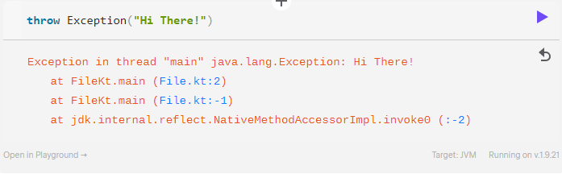

# Tratamento de Exceções em Kotlin

GitHub: <https://github.com/marlonprado04/BOOTCAMP_backend_com_kotlin/tree/main/10_CURSO_tratamento_de_execoes_kotlin>
Conteúdos DB: Kotlin (<https://www.notion.so/Kotlin-c848ec969da34f13b537af3274acc0ff?pvs=21>)
Plano de estudos DB: Bootcamp: Backend com Kotlin  (<https://www.notion.so/Bootcamp-Backend-com-Kotlin-bb7bbc8a2a3443ed9470a119aa6e2d30?pvs=21>)
Categoria: Curso
Status: Done
Criado em: January 16, 2024 12:08 PM
Modificado em: January 16, 2024 9:16 PM
Data: 16/01/2024

## Índice

- [Tratamento de Exceções em Kotlin](#tratamento-de-exceções-em-kotlin)
  - [Índice](#índice)
  - [Antes de começar](#antes-de-começar)
  - [Tratamento de Exceções em Kotlin](#tratamento-de-exceções-em-kotlin-1)
    - [Introdução e Objetivos](#introdução-e-objetivos)
    - [Manipulando Minhas Primeiras Exceções](#manipulando-minhas-primeiras-exceções)
    - [Try É Uma Expression](#try-é-uma-expression)
    - [Checked Exceptions… Aqui não](#checked-exceptions-aqui-não)
    - [Exceções Customizadas e Idiomáticas](#exceções-customizadas-e-idiomáticas)
    - [Throw É Uma Expression, Tipo Nothing e Conclusão](#throw-é-uma-expression-tipo-nothing-e-conclusão)
  - [Materiais de apoio e referências](#materiais-de-apoio-e-referências)

## Antes de começar

- [x]  Criar pasta referente ao curso
- [x]  Adicionar link da pasta nos atributos do curso
- [x]  Adicionar arquivos e links adicionais ao repositório (pdf, pptx, etc)

## Tratamento de Exceções em Kotlin

### Introdução e Objetivos

Nesse curso vamos aprender como funcionam as exceções e como lidar com lidar com eventuais erros que podemos nos deparar no dia a dia.

Primeiro vamos falar das classes de exceção para entender como podemos manipular e lançar exceções dentro do código.

Na documentação podemos ver que todas as exceções herdam a classe `Throwable`.

Abaixo um exemplo de uso de Exception junto do seu retorno:



### Manipulando Minhas Primeiras Exceções

Uma exceção ocorre quando há um fluxo inesperado no código, seja por alguma necessidade da regra de negócio ou algum erro que não nos atentamos na hora de programar.

Por exemplo, ao tentar dividir por 0 o Kotlin aponta erro:


A maneira de lidar com isso é utilizando a estrutura `try / catch`

Podemos usar a estrutura do try / catch para capturar exceções e fazer os tratamentos e demonstrações necessários, por exemplo:

```kotlin
fun main() {

	val a = 10
    val b = 0 
    
    
    try {
        // Tenta dividir por 0
        val divisao = a / b
    } catch (e: Throwable) {
        // Imprime a pilha de erro contido na exceção
        e.printStackTrace();
        
        // Imprime somente a mensagem de erro
        print(e.message) // "/ by zero"
    }
}
```

Podemos também usar mais de um catch para separar as exceções:

```kotlin
fun main() {

	val a = 10
    val b = 0 
    
    
    try {
        // Tenta dividir por 0
        val divisao = a / b
    } catch (e: ArithmeticException) {
        // Imprime mensagem personalizada
		println("Ocorreu uma exceção aritmética!")
    } catch(e: Throwable){
        // Imprime exceção padrão
        println(e.message)
    }
}
```

Além disso, o Try Catch traz o finally que permite colocar um bloco de código que será executado independente de erros nas tentativas:

```kotlin
fun main() {

	val a = 10
    val b = 0 
    
    
    try {
        // Tenta dividir por 0
        val divisao = a / b
    } catch (e: ArithmeticException) {
        // Imprime mensagem personalizada
		println("Ocorreu uma exceção aritmética!")
    } catch(e: Throwable){
        // Imprime exceção padrão
        println(e.message)
    }finally(){
        // Imprime mensagem independende de erro ou acerto
        println("O finally foi executado!")
    }
}
```

### Try É Uma Expression

Em Kotlin podemos tratar o Try Catch como uma expressão que retorna valores.

Por exemplo, abaixo tentamos armazenar o resultado de uma divisão senão armazenamos null na variável:

```kotlin
fun main() {

	val a = 10
    val b = 0 
    
    // Declara variável e tenta armazenar divisão, senão armazena null
    val divisao = try { a / b } catch (e: ArithmeticException) { null }
	
    // Printa a variável
    println(divisao)
}
```

Abaixo um outro exemplo com mensagens de status durante o processo:

> Repare que é necessário declarar a mensagem antes da operação que deve ser armazenada na variável, caso contrário o try aponta erro
>

```kotlin
fun main() {

	val a = 10
    val b = 0 
    
    // Declara variável e tenta armazenar divisão, senão armazena null
    val divisao = try { 
        println("Tentando a divisão...")
        a / b 
    } catch (e: ArithmeticException) {
        println("Erro na divisão!")
        null
    } finally{
        println("Encerrando tentativa. \n")
    }
	
    // Printa a variável
    println("Resultado da divisao: " + divisao)
}
```

### Checked Exceptions… Aqui não

Diferente de Java em Kotlin não existem Checked Exceptions que servem como exceções previstas pela linguagem que exigem a criação de um tratamento de erro.

Abaixo um diagrama referente à linguagem Java:


A documentação Kotlin justifica a ausência de checked exceptions conforme abaixo:


### Exceções Customizadas e Idiomáticas

No código abaixo desenvolvemos uma exceção customizada na simulação de um programa para realizar o voto:

```kotlin
// Cria uma exceção específica para voto 
class IllegalVoterException(message: String) : Throwable(message)

// Função para simular um voto
@Throws(IllegalVoterException::class)
fun vote(name: String, age: Int){
    // Verifica idade da pessoa
    if (age < 16){
        throw IllegalVoterException("$name você não pode votar!")
    }
    println("Voto de $name realizado com sucesso!")
}

fun main() {
    vote("Marlon", 23);
    vote("Joana", 15)
}
```

### Throw É Uma Expression, Tipo Nothing e Conclusão

Como podemos utilizar o Throw como expression e Kotlin podem surgir situações onde o resultado de erro não é tratado.

Nesse caso, como retorno de expressão, o throw traz o tipo `nothing` para ser armazenado nos dados.

Abaixo um exemplo:

```kotlin
fun main() {
    // Tenta armazenar o nome da pessoa ou armazena "nothing" se não existir
    val s = person.name ?: throw IllegalArgumentException("Name required")
}
```

Abaixo um outro exemplo:

```kotlin
data class Person (val name: String?)

// Função fail para retornar "nothing" quando der erro
fun fail(message: String): Nothing {
    // Cria erro com mensagem
    throw IllegalArgumentException(message)
}
    
fun main() {
    // Instancia pessoa
    var person = Person(null)
    
    // Retorna exceção pois o nome da pessoa está nulo
    val s = person.name ?: fail("Name required")
	println(s)
}
```

Outros detalhes importantes envolvem a diferença entre Void, Unit e Nothing.

Detalhes podem ser vistos, por exemplo, [neste link](https://stackoverflow.com/questions/55953052/kotlin-void-vs-unit-vs-nothing) do StackOverflow

## Materiais de apoio e referências

A documentação oficial do Kotlin se encontra, [neste link](https://kotlinlang.org/docs/home.html)
